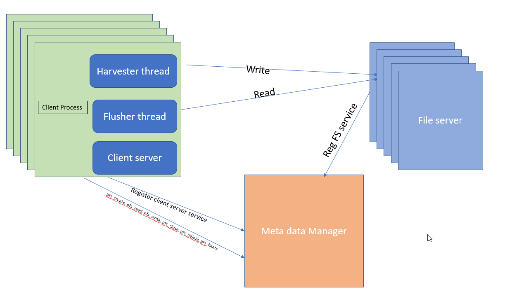

# Parallel-file-system

```
sudo apt-get install build-essential autoconf libtool pkg-config
```
 https://github.com/protocolbuffers/protobuf/blob/master/src/README.md
 
 ```
sudo apt-get install autoconf automake libtool curl make g++ unzip
 git clone https://github.com/protocolbuffers/protobuf.git
    cd protobuf
    git submodule update --init --recursive
    ./autogen.sh
      ./configure
     make
     make check
     sudo make install
     sudo ldconfig # refresh shared library cache.
 ```

Setup GRPC
```
git clone -b $(curl -L https://grpc.io/release) https://github.com/grpc/grpc
cd grpc
git submodule update --init
cd grpc/third_party/protobuf
sudo make install
cd ../../
make
sudo make install
 ```

Generating file from .proto file.
``` 
cd to proto directory and execute
protoc -I.  --grpc_out=. --plugin=protoc-gen-grpc=`which grpc_cpp_plugin` *.proto
protoc -I.  --cpp_out=. .
```


<h1>High level Architecture </h1>



Client consist of 4 parts
1) <b>Client</b>:- All code related to PFS calls to the metadata manager
2) <b>client server thread</b>: - This service provides permission revoke functionality 
3) <b>Harvester thread</b>:- Talk to File server for write
4) <b>Flusher thread</b>:- Remove overflowing cache block while taking care of dirty blocks.

All PFS calls goes to meta data manger first (related to create/delete/stats/permission) and file access(read and write) happens with file server. 

To resemble to real world cases, client and file server can join dynamically(hardcoding ipaddress not required). This is achieved by service registration service, where every client and server will register itself with meta data manager.


In the meta data manager we implemented functions for token management. We have a list of all the permissions that we have for each file. Based on this list, when a client requests a new permission, some revoke permission messages will be sent to all the clients with conflicts, and then as soon as all the conflicts are solved, we will grant the permission to requesting client.
Another service that meta data manager will provide is for updating the fstat in meta data manager. As soon as a client writes to each file server, they will send a message to meta data management for updaing the stats. 
The last service in the meta data manager is for registering clients and servers. As soon as MM received the register request, it will create a connection to the server or client, and store it in one of the data structures.

In MM, we store all the permission, assigned servers, and all the stat for each file.


File server provides three functions. (1) function for writing the contents of a file for each server. (2) function for reading from each file server. (3) function for deleting a file from servers.
In addition it will generate the messages for updating the stat of each file and then it will send it to MM.
